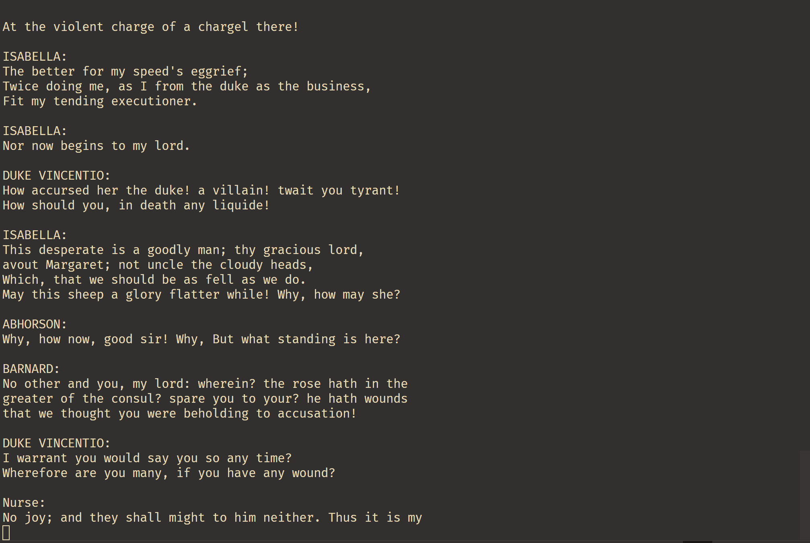

## 📘 mygpt — GPT Implementation in Rust using Burn

A minimal GPT‑style model implemented in Rust using the Burn machine learning framework.
This project demonstrates how to build and train a simple transformer language model from scratch. It includes both English and Chinese example models and provides training and inference code.

## 🎥 Video Demonstrations

You can also find full walkthrough videos:

🌐 YouTube (Chinese): https://www.youtube.com/playlist?list=PL3lRZ4mOrPobeASemC7hvDfGc93a530gB

📺 Bilibili (Chinese): https://www.bilibili.com/video/BV1A2tnzSEsv

Feel free to watch them for setup, training, and usage guidance.

## 🚀 How to Use

### 1. Choose a Dataset

Copy one of the model folders under the root (artifact_en, artifact_cn, or artifact_4in1) to a folder named artifact.

Example:

```bash
cp -r artifact_en artifact
```

### 2. Modify Source File

Open the source code in your editor, and replace the model file name inside the code:

```rust
let text = include_str!("4in1.txt");
```

Replace "4in1.txt" with the filename you want to train on.

### 3. Train or Inference

Use cargo to train or generate text — just like any Rust project:

```bash
cargo run --release
```

The training script will train a simplified GPT model on the chosen dataset.
After training, inference will generate text continuations.

## 📌 Notes

- This implementation is designed for education and experimentation, not state‑of‑the‑art performance.

- The model and code are kept minimal and easy to understand.

- Burn allows us to build and train neural networks fully in Rust.

## 🧠 Why This Project

This repository aims to:

- Show how to structure transformer models in Rust using Burn

- Provide training and inference examples for different language datasets

- Help Rust/Burn users understand GPT architectures

## 📸 Screenshots



## 🗂 Additional Notes

The `note` folder contains the original files of the diagrams used in the video. These can be opened with **Microsoft OneNote**.

For users who do not have OneNote installed, you can view the diagrams in the `note.mht` file, which is a single web page.

## 📝 License

This project is licensed under MIT License.
